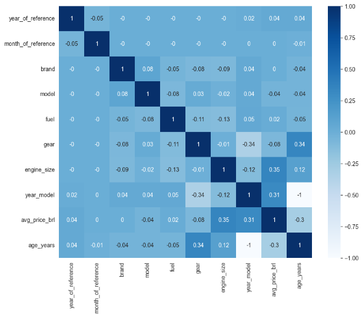
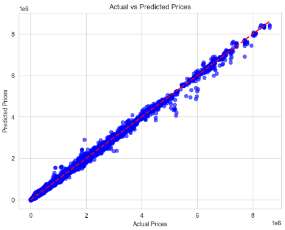

# Vehicle Price Prediction using Machine Learning

## Table of Contents
1. [Project Overview](#project-overview)
2. [Data](#data)
3. [Libraries Used](#libraries-used)
4. [Evaluation Metrics](#evaluation-metrics)
5. [Example Results](#example-results)
6. [Future Improvements](#future-improvements)
7. [Author](#author)

## Project Overview

This project aims to build a machine learning model to predict the average price of vehicles based on various features such as engine size, fuel type, brand, and other vehicle characteristics. The model can be applied to predict the price of a vehicle, which could potentially be used in applications like insurance pricing and market analysis.

### Key Features of the Project:
- **Dataset Acquisition**: The data is sourced from FIPE (Fundação Instituto de Pesquisas Econômicas), a prominent vehicle price reference in Brazil.
- **Data Preprocessing**: Cleaning and transforming the dataset to handle missing values, categorical encoding, and feature scaling.
- **Feature Engineering**: Creating new features like vehicle age and transforming existing ones for improved model performance.
- **Model Building**: Implementing **Random Forest Regressor** for regression tasks.
- **Hyperparameter Tuning**: Using **RandomizedSearchCV** for efficient model optimization.
- **Model Evaluation**: Assessing model performance using metrics such as MAE, MSE, RMSE, and R².
- **Exploratory Data Analysis (EDA)**: Visualizing data distributions and correlations to understand patterns.

## Data

The dataset used in this project contains information about cars sold in Brazil. It was collected from **FIPE (Fundação Instituto de Pesquisas Econômicas)**, which provides price benchmarks for vehicles. The dataset includes the following features:

- **Year of Reference**: The year when the car's price was referenced.
- **Model**: The car's model.
- **Brand**: The car's brand (e.g., Ford, Chevrolet, Toyota).
- **Engine Size**: The size of the vehicle's engine in liters.
- **Fuel Type**: Type of fuel the vehicle uses (e.g., gasoline, ethanol, flex).
- **Gear Type**: Transmission type (manual or automatic).
- **Age of Vehicle**: The age of the vehicle in years.
- **Average Price in BRL**: The target variable for the regression model.

You can access the dataset [here](https://www.kaggle.com/datasets/vagnerbessa/average-car-prices-bazil/data).

## Libraries Used

This project uses a variety of libraries to preprocess data, build machine learning models, and evaluate results. Key libraries include:

- **Pandas**: For data manipulation and cleaning.
- **NumPy**: For numerical operations.
- **Matplotlib & Seaborn**: For data visualization and plotting.
- **Scikit-Learn**: For building and evaluating machine learning models.
- **Kaggle**: For dataset downloading and management.

## Evaluation Metrics

The model’s performance is evaluated using the following metrics:

- **MAE (Mean Absolute Error)**: The average magnitude of the errors in predictions, without considering their direction.
- **MSE (Mean Squared Error)**: The average of the squared errors between predicted and actual values.
- **RMSE (Root Mean Squared Error)**: The square root of MSE, which brings the error back to the same unit as the target variable.
- **R² (Coefficient of Determination)**: Indicates how well the model's predictions approximate the real data.

## Example Results

After training the model on the dataset, the following results were obtained:
- MAE: 4659.15
- MSE: 151821780.30
- RMSE: 12321.60
- R²: 1.00

These metrics suggest that the model is performing well with a high degree of accuracy in predicting car prices.

## Future Improvements

Some possible areas for future work include:

- **Feature Engineering**: Incorporating additional features like vehicle condition, mileage, or location data.
- **Model Enhancements**: Experimenting with other algorithms like Gradient Boosting, XGBoost, or neural networks to improve prediction accuracy.
- **Hyperparameter Optimization**: Expanding the hyperparameter grid to explore further optimization possibilities.

## Author

- [LinkedIn](https://www.linkedin.com/in/gustavo-maldonado-saffiotti) 
- [GitHub Profile](https://github.com/Gustavo-Saffiotti)

Feel free to open an issue or pull request for suggestions or improvements.
